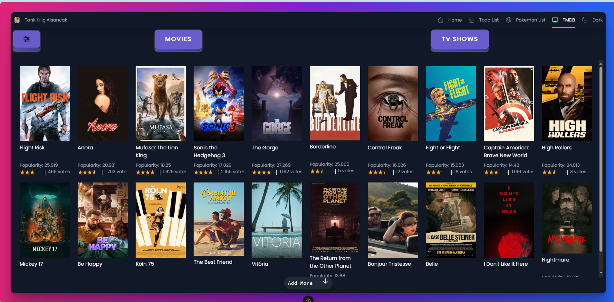

# Nuxt 3 Portfolyo
[Proje linki](mynuxtportfolyo.netlify.app)

Bu proje, Nuxt 3, TailwindCSS ve Nuxt UI kullanarak oluşturulmuş bir portfolyodur. İçerisinde üç farklı proje bulunmaktadır:


## Teknolojiler

- **Nuxt 3:** Modern ve performanslı bir Vue.js framework'ü.
- **Tailwind CSS:** Utility-first CSS framework'ü, hızlı ve esnek stil oluşturma imkanı sağlar.
- **Nuxt UI:** Nuxt.js için optimize edilmiş, güzel ve kullanımı kolay UI bileşenleri.

## Projeler

### 1. Todo List


Bu proje, rastgele kullanıcılar ve onlara atanmış yapılacaklar listesi görüntüler.

- **Kullanıcılar:** `randomuser.me` API'si kullanılarak rastgele kullanıcılar çekilmiştir.
- **Todolar:** `jsonplaceholder.typicode.com` API'si kullanılarak todolar çekilmiştir.
- **Özellikler:** Her kullanıcının kendine ait bir todo listesi vardır. Filtreleme seçenekleri ile todoları filtreleyebilirsiniz.


### 2. Pokemon Listesi


Bu proje, popüler Pokemon karakterlerini listeler, filtreler ve detaylı bilgilerini gösterir.

- **Veri Kaynağı:** `pokeapi.co` API'si kullanılarak Pokemon verileri çekilmiştir.
- **Özellikler:** Pokemonları listeleme, filtreleme ve detaylı bilgilerini görüntüleme.


### 3. TMDB Film & Dizi



Bu proje, The Movie Database (TMDB) API'sini kullanarak güncel film ve dizileri listeler ve filtreler.

- **API Anahtarı:** Bu projeyi kullanmak için bir TMDB API anahtarı gereklidir.  `https://www.themoviedb.org/` adresinden bir API anahtarı oluşturabilirsiniz.
- **.env Dosyası:** Oluşturduğunuz API anahtarını `.env` dosyasına aşağıdaki gibi ekleyin:

```bash
TMDB_API_KEY = "*********************"
```
- Özellikler: Film ve dizileri listeleme, filtreleme ve detaylı bilgilerini görüntüleme.

## Setup

Make sure to install the dependencies:

```bash
npm install

pnpm run dev
```

Check out the [deployment documentation](https://nuxt.com/docs/getting-started/deployment) for more information.
